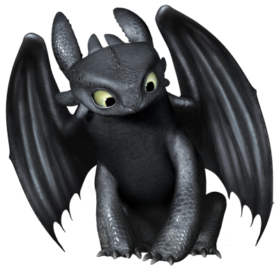

#Dragon Images

<br>

##Mushu from Mulan


<br>

##Maleficent from Sleeping Beauty


<br>

##Toothless from How to Train your Dragon


<br><br>

1. Load packages
```{r}
suppressMessages(library(tidyverse))
suppressMessages(library(ape))
suppressMessages(library(ggplot2))
suppressMessages(library(reshape2))
suppressMessages(library(ggtree))
```

<br>

2. Load DragonNexus data and reformat 
```{r}

DragonNexus <- read.nexus.data("https://colauttilab.github.io/Data/DragonMatrix.nex")
```

<br>

3. Load my encoded dragons' data and reformat 
```{r}

TraitCode <- read.csv("TraitCodes.csv", colClasses='character') 

MyDragons <- read.csv("MyDragonsEncoded.csv", colClasses='character') 

df <- unite(MyDragons, code, -Dragon, sep="") #merge binary data into one column for each dragon
df

DragonSplit <- sapply(df$code, strsplit, split="") #split binary code so each number has an individual column
```

<br>

4. Merge DragonNexus data and my encoded dragons' data 
```{r}

ListDragonMerge <- c(DragonNexus, DragonSplit)
```

<br>

5. Weight the traits
```{r}

WeightsDat <- read.csv("https://colauttilab.github.io/Data/Weights.csv")

#need to convert from factor to a single vector
WeightsVector <- as.vector(WeightsDat$Weight) 
WeightsSplit <- strsplit(WeightsVector,"")
Weights <- unlist(WeightsSplit)

#Convert each letter to its corresponding weight value
for(i in 1:length(Weights)){
  if(Weights[i] %in% LETTERS){
    Weights[i] <- which(LETTERS==Weights[i])+9
  }
}
Weights <- as.numeric(Weights)

WtListDragonMerge <- ListDragonMerge #Make a new weighted data frame object

#Multiply the weight value by the trait vector for each dragon
for(i in 1:length(ListDragonMerge)){
  Rep <- ListDragonMerge[[i]]==1
  WtListDragonMerge[[i]][Rep] <- Weights[Rep]
  Rep <- NA
}
```

<br>

6. Unlist WtListDragonMerge and put into new data frame as a matrix
```{r}

WtListDragonMergeDF <- data.frame(matrix
                                 (unlist
                                 (WtListDragonMerge),ncol=78,byrow=T)) 
```

<br>

7. Add row names to data 
```{r}

names <- data.frame(names(DragonNexus))
colnames(names)[1] <- "Dragon"

names2 <- data.frame(MyDragons$Dragon)
colnames(names2)[1]<-"Dragon"

namesALL <- rbind(names, names2)

row.names(WtListDragonMergeDF) <- namesALL$Dragon
```

<br>

8. Create a distance matrix and plot
```{r}

WtDragonDist <- dist(WtListDragonMergeDF)

WtDragonDistMat <- as.matrix(WtDragonDist)

WtPDat <- melt(WtDragonDistMat)
ggplot(data = WtPDat, aes(x=Var1, y=Var2, fill=value)) + 
  geom_tile()+scale_fill_gradientn(colours=c("white","blue","green","red")) +
  theme(axis.text.x = element_text(angle = 90, hjust = 1, vjust = 0.5))
```
### __Figure 1.__ *Distance Matrix Plot*
##### df 

<br>

9. Creat phylogenic tree using the minimal evolution (ME) model
```{r}

WtDragonDist <- dist(WtListDragonMergeDF)

WtDragonTree <- fastme.bal(WtDragonDist)

#Add labels based on country and highlight my 3 dragons 
Country <- gsub("[0-9\\.]+([^X]+)","\\1",row.names(WtListDragonMergeDF))
Country<-gsub("X+","",Country)
MyDragonsOnly <- (Country[78:80])

WtDTc<-groupOTU(WtDragonTree,MyDragonsOnly)
ggtree(WtDTc,layout="circular",aes(colour=group))+geom_tiplab(size=2,aes(angle=angle))
```
### __Figure 2.__ *Phylogenic Tree Plot*
#####

